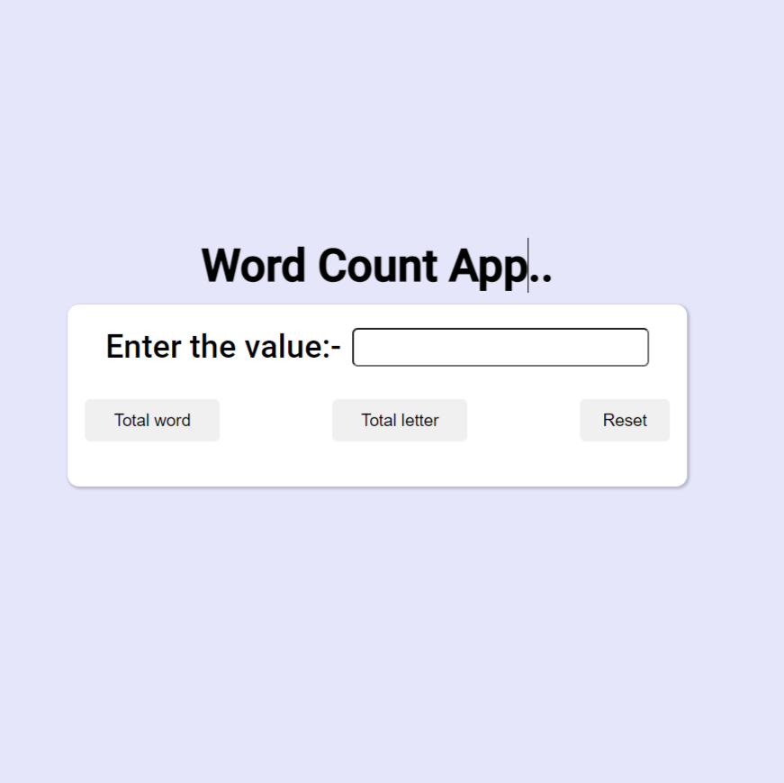

# Word Count App

 ### I have made a Word Count app by the help of HTML,CSS and JavaScript.

## Technology Used:-
  - ` HTML ` 
  - ` CSS ` 
  - ` JS ` 

 

 
 

Live Link:- [Click here!](https://word-count-app.netlify.app/)

Picture of my project:-

## What I learned from this project?

 - Most important thing which I learned from this project is About Event Listener.

 - And then I learned that how we can take input from user and save that input inside a variable  by the help of JavaScript.

### Time Taken For This Project:- 2 hours.
